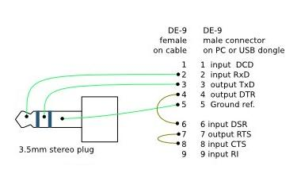

To deploy the root file system, you need a micro SD card (or USB device).

.. warning::

 | The SD card must meet the following requirements:
 |  - SD card must be formatted as FAT or FAT32.
 |  - SD card size must be 32GB (or smaller) and SDHC format. SDXC format is not supported.

.. warning::

 | The content of the SD card will be lost forever!

1. Copy the following kernel and root file system files to your SD card

.. raw:: html

 

 
<b class="admonition-host">&nbsp;&nbsp;Host&nbsp;&nbsp;</b>&nbsp;&nbsp;<a style="float: right;" href="javascript:select_text( 'deploy_rootfs_rst-host-101' );">select</a>

 <pre class="line-numbers pre-replacer" data-start="1"><code id="deploy_rootfs_rst-host-101" class="language-markup">cp -r ~/architech_sdk/architech/galileo/yocto/meta-clanton_v1.0.1/yocto_build/tmp/deploy/images/boot /path/to/your/sd/card/device
 cp ~/architech_sdk/architech/galileo/yocto/meta-clanton_v1.0.1/yocto_build/tmp/deploy/images/bzImage /path/to/your/sd/card/device
 cp ~/architech_sdk/architech/galileo/yocto/meta-clanton_v1.0.1/yocto_build/tmp/deploy/images/core-image-minimal-initramfs-clanton.cpio.gz /path/to/your/sd/card/device
 cp ~/architech_sdk/architech/galileo/yocto/meta-clanton_v1.0.1/yocto_build/tmp/deploy/images/image-full-galileo-clanton.ext3 /path/to/your/sd/card/device</code></pre>
 
 
 

2. Unmount the micro SD card from your computer

3. Interact with the embedded Linux using a cable connected to the minijack UART port.

.. important::

 | For a 3 pin audio jack, the connections are as follows:
 |  - Sleeve  = Ground
 |  - Ring    = RXD (Input to Clanton)
 |  - Tip     = TXD (Output from Clanton)

4. Insert the SD card, then power on the board.

5. Connect the audio jack to UART connector

.. important::

 The first time you boot the board may take several minutes. This is expected behavior due to the SSH component creating cryptographic keys on the first boot.

.. warning::
 
 To boot from SD/USB, the grub instance embedded in the SPI flash is hardcoded to search for a boot/grub/grub.conf file in partition 1 on the SD/USB card. This is compatible with the factory formatting of most SD/USB devices. By default, the UEFI firmware does not try to boot from SD or USB, it is handled by grub

.. warning::

 If you use an SD or USB device that has been reformatted after manufacturing, you might experience problems booting from it. First, try to boot with a different memory device and see if the problem goes away.
