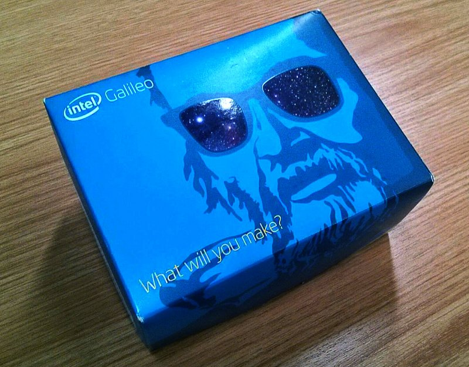
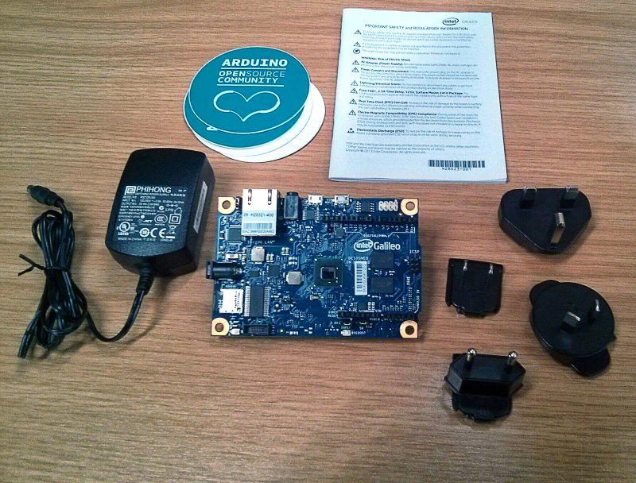
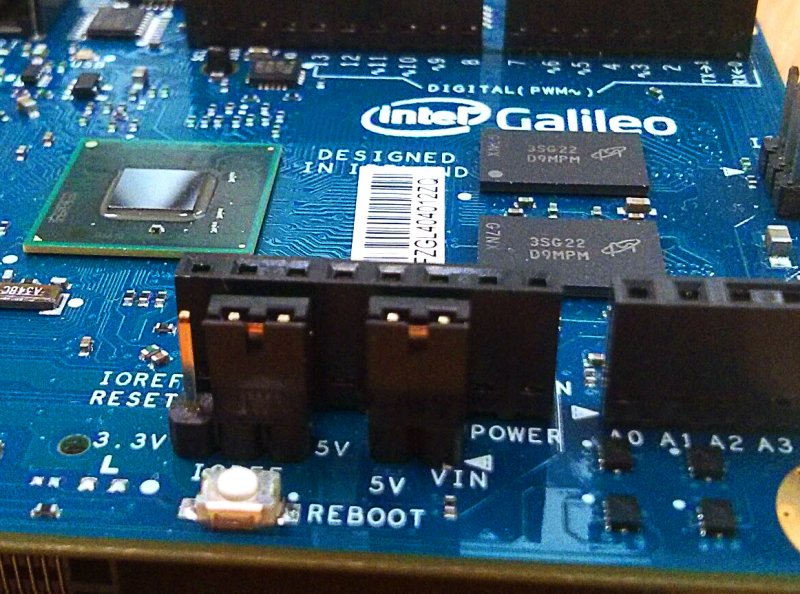

.. _unboxing_label:

Unboxing
^^^^^^^^

Intel Galileo board comes into this box

Galileo includes a “universal” wall adapter, which should work for just about anyone. If you’re using your own supply, make sure it can supply up to 3A. And remember that 5V is the max and min on that supply input.

Make sure IOREF has this configuration:

 
Read the :ref:`quick` Chapter to boot the board

Enjoy!
